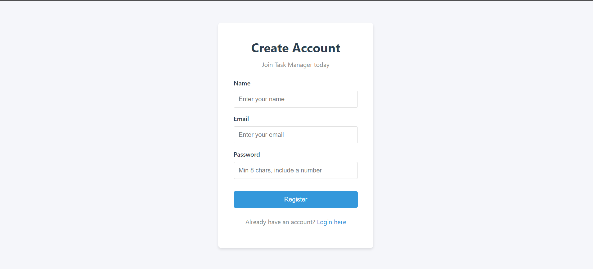
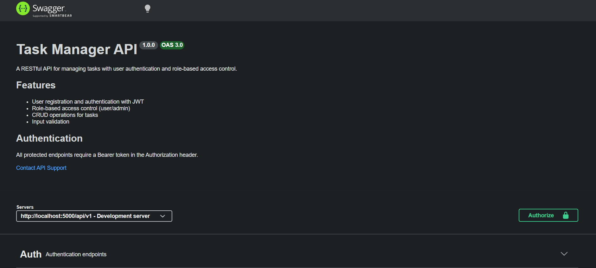
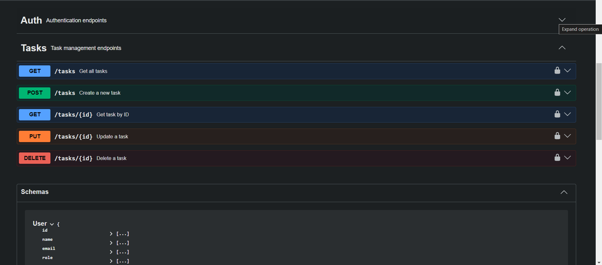
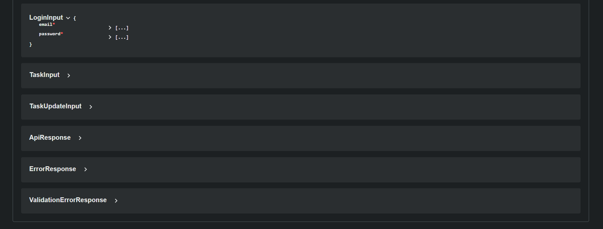
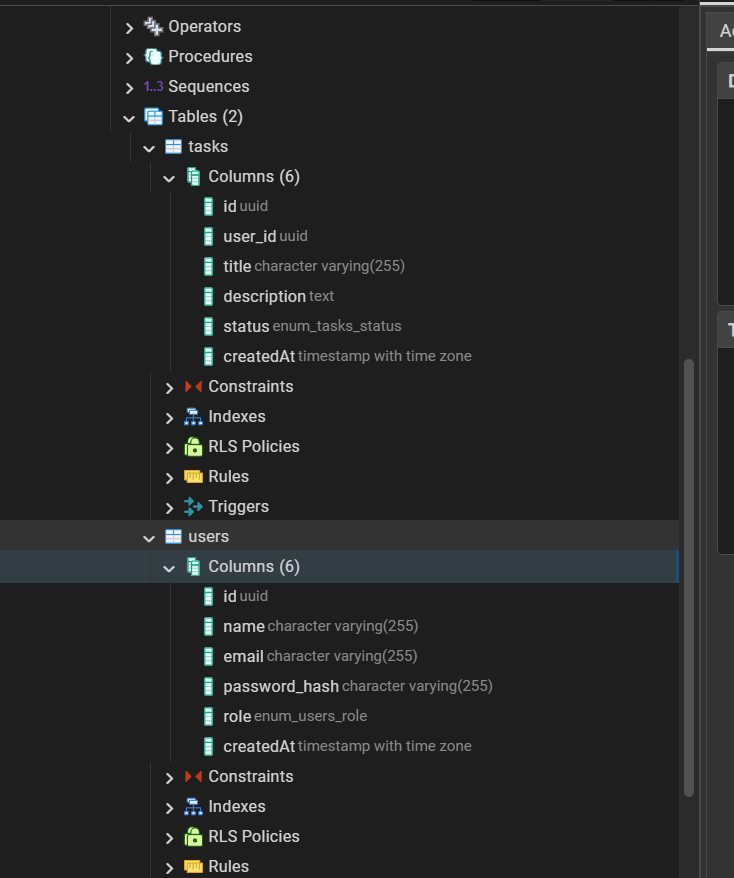
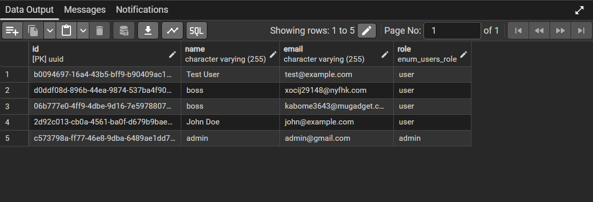

# 🗂️ Task Manager — REST API with Authentication & RBAC

A production-ready, full-stack Task Manager application featuring JWT 
authentication, role-based access control, and complete CRUD operations. 
Built with a Node.js/Express backend and React frontend as part of a 
Backend Developer Intern assignment.

---

## 📸 Screenshots

### Login Page


### Register Page


### Dashboard


### Swagger API Docs




### Database Schema (pgAdmin)



---

## ⚙️ Tech Stack

### Backend
| Technology | Purpose |
|------------|---------|
| Node.js 20+ | Runtime |
| Express.js | Web framework |
| PostgreSQL | Primary database |
| Sequelize ORM | Database management |
| JWT + bcrypt | Authentication & hashing |
| express-validator | Input validation |
| Swagger (OpenAPI 3.0) | API documentation |
| Helmet + CORS | Security headers |
| Docker | Containerization |

### Frontend
| Technology | Purpose |
|------------|---------|
| React 18 (Vite) | UI framework |
| React Router DOM | Client-side routing |
| Axios | HTTP client with interceptors |
| React Context API | Global auth state |

---

## 🚀 Quick Start

### Prerequisites
- Node.js v20+
- PostgreSQL 12+
- npm or yarn
- (Optional) Redis for caching
- (Optional) Docker for containerized deployment

---

### 1. Clone the repository
```bash
git clone https://github.com/Utkarsh/task-manager.git
cd task-manager
```

---

### 2. Backend setup
```bash
cd backend
npm install
```

---

### 3. Configure environment variables

Create a `.env` file inside the `backend/` directory:
```env
PORT=5000
NODE_ENV=development
JWT_SECRET=your_super_secret_key_here_make_it_long_and_secure
JWT_EXPIRES_IN=7d
DB_HOST=127.0.0.1
DB_PORT=5432
DB_NAME=taskmanager
DB_USER=postgres
DB_PASSWORD=your_postgres_password
```

> ⚠️ Never commit your `.env` file. It is already listed in `.gitignore`.

---

### 4. Create the PostgreSQL database

Open pgAdmin or psql and run:
```sql
CREATE DATABASE taskmanager;
```

---

### 5. Start the backend server
```bash
npm run dev
```

Sequelize will auto-sync the database tables on first run.

---

### 6. Frontend setup
```bash
cd ../frontend
npm install
npm run dev
```

---

## 🌐 Access URLs

| Service | URL |
|---------|-----|
| Frontend | http://localhost:5173 |
| Backend API | http://localhost:5000/api/v1 |
| Swagger Docs | http://localhost:5000/api-docs |
| Health Check | http://localhost:5000/health |

---

## 📡 API Endpoints

### Authentication
| Method | Endpoint | Access | Description |
|--------|----------|--------|-------------|
| POST | `/api/v1/auth/register` | Public | Register new user |
| POST | `/api/v1/auth/login` | Public | Login & receive JWT |
| GET | `/api/v1/auth/me` | Private | Get current user info |

### Tasks
| Method | Endpoint | Access | Description |
|--------|----------|--------|-------------|
| GET | `/api/v1/tasks` | User/Admin | Get tasks (own or all) |
| GET | `/api/v1/tasks/:id` | User/Admin | Get single task by ID |
| POST | `/api/v1/tasks` | User/Admin | Create new task |
| PUT | `/api/v1/tasks/:id` | User/Admin | Update task |
| DELETE | `/api/v1/tasks/:id` | User/Admin | Delete task |

> All task routes require a valid JWT token in the Authorization header:
> `Authorization: Bearer <your_token>`

---

## 🗄️ Database Schema

### Users Table
| Column | Type | Constraints |
|--------|------|-------------|
| id | UUID | Primary Key |
| name | VARCHAR(100) | NOT NULL |
| email | VARCHAR(255) | UNIQUE, NOT NULL |
| password_hash | TEXT | NOT NULL |
| role | ENUM | 'user' or 'admin' |
| createdAt | TIMESTAMP | Auto-generated |

### Tasks Table
| Column | Type | Constraints |
|--------|------|-------------|
| id | UUID | Primary Key |
| user_id | UUID | FK → users.id (CASCADE) |
| title | VARCHAR(255) | NOT NULL |
| description | TEXT | Optional |
| status | ENUM | pending / in_progress / completed |
| createdAt | TIMESTAMP | Auto-generated |

---

## 👥 User Roles

### User
- Create, read, update, delete **own tasks only**
- Cannot access other users' tasks
- Default role on registration

### Admin
- Read, update, delete **all tasks** from all users
- View tasks with owner information
- Must be manually assigned in the database

#### To promote a user to admin, run in pgAdmin:
```sql
UPDATE users 
SET role = 'admin' 
WHERE email = 'your-email@example.com';
```

---

## 🔐 Security Practices

| Practice | Implementation |
|----------|---------------|
| Password hashing | bcrypt with 12 salt rounds |
| Authentication | JWT with 7-day expiry |
| HTTP headers | helmet.js middleware |
| CORS | Restricted to frontend origin only |
| Input validation | express-validator on all endpoints |
| SQL injection | Prevented via Sequelize ORM (parameterized queries) |
| Secrets management | All secrets in .env, never hardcoded |
| Sensitive data | password_hash excluded from all API responses |

---

## 📦 Project Structure
```
TaskManager/
├── backend/
│   ├── src/
│   │   ├── config/
│   │   │   ├── db.js            # Sequelize connection
│   │   │   └── env.js           # Environment variable loader
│   │   ├── middlewares/
│   │   │   ├── auth.middleware.js     # JWT verification
│   │   │   ├── role.middleware.js     # RBAC role guard
│   │   │   ├── error.middleware.js    # Global error handler
│   │   │   └── validate.middleware.js # Input validation runner
│   │   ├── models/
│   │   │   └── user.model.js    # User Sequelize model
│   │   ├── modules/
│   │   │   ├── auth/            # Register, login, me
│   │   │   └── tasks/           # Full CRUD for tasks
│   │   ├── routes/
│   │   │   └── index.js         # Versioned route mounting
│   │   ├── utils/
│   │   │   ├── jwt.utils.js     # Token sign & verify
│   │   │   └── response.utils.js # Standardized responses
│   │   └── app.js               # Express app configuration
│   ├── swagger.yaml             # OpenAPI 3.0 documentation
│   ├── server.js                # Application entry point
│   ├── Dockerfile               # Docker configuration
│   ├── .env.example             # Environment variable template
│   └── package.json
├── frontend/
│   ├── src/
│   │   ├── components/
│   │   │   ├── Navbar.jsx
│   │   │   ├── TaskCard.jsx
│   │   │   └── ProtectedRoute.jsx
│   │   ├── context/
│   │   │   └── AuthContext.jsx  # JWT storage & auth state
│   │   ├── pages/
│   │   │   ├── Login.jsx
│   │   │   ├── Register.jsx
│   │   │   └── Dashboard.jsx
│   │   ├── services/
│   │   │   └── api.js           # Axios instance + interceptors
│   │   └── App.jsx              # Routing configuration
│   └── package.json
├── screenshots/                 # App screenshots
└── README.md
```

---

## 🐳 Docker Deployment

### Build the image
```bash
cd backend
docker build -t taskmanager-backend .
```

### Run the container
```bash
docker run -p 5000:5000 --env-file .env taskmanager-backend
```

---

## 📈 Scalability Notes

### Horizontal Scaling
JWT is stateless — no server-side session storage required. Multiple 
Node.js instances can run behind an Nginx load balancer without session 
affinity concerns, enabling true horizontal scaling.

### Caching Layer (Redis)
The modular architecture is Redis-ready for:
- Caching frequent database reads (task lists, user profiles)
- Token blacklisting on logout for enhanced security
- Rate limiting per user or IP

### Microservices Ready
Each module (auth, tasks) is fully self-contained with its own routes, 
controllers, services, and validators. Any module can be extracted into 
an independent microservice as traffic grows — no business logic rewrite needed.

### Container Orchestration
The included Dockerfile supports deployment to:
- Kubernetes (EKS, GKE, AKS)
- Docker Swarm
- AWS ECS / Google Cloud Run / Azure Container Instances

### Database Scaling
- PostgreSQL read replicas for high-read workloads
- Connection pooling via Sequelize pool config
- UUID primary keys for distributed database compatibility

---

## 📬 API Documentation

Full interactive API documentation available at:
**http://localhost:5000/api-docs**

Built with Swagger UI (OpenAPI 3.0). All endpoints include:
- Request body schemas
- Response schemas
- Authentication requirements
- Status code descriptions

---

## 👨‍💻 Author

**Utkarsh**  
📧 jainutkarsh1379@gmail.com
🔗 GitHub: https://github.com/jainutkarshh 
💼 LinkedIn: https://www.linkedin.com/in/utkarsh-jain05

---

## 📄 License

ISC
